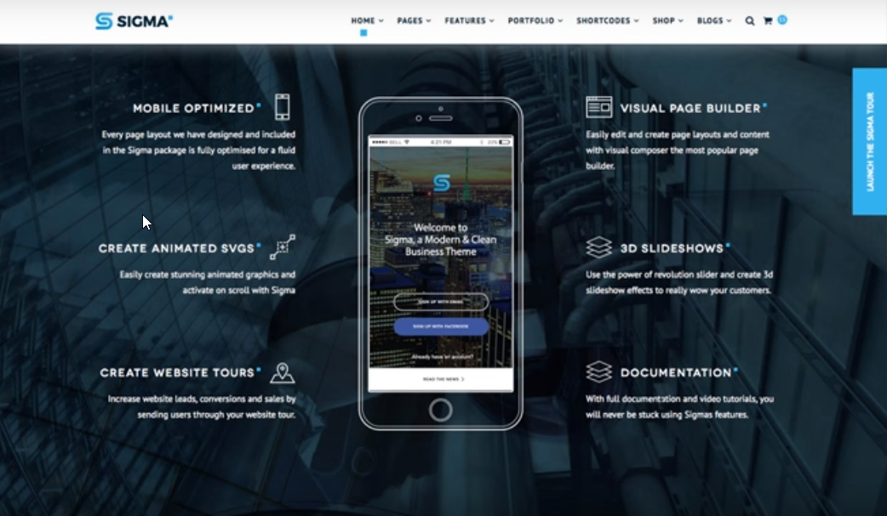
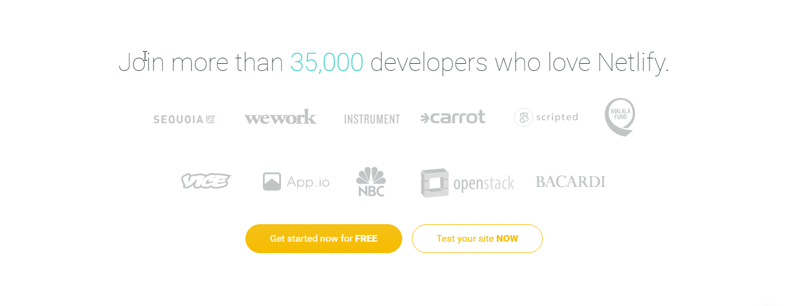
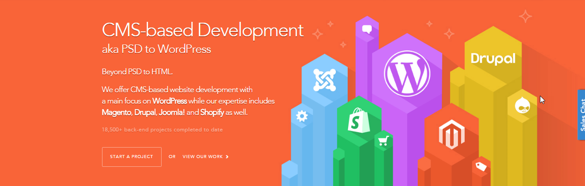

# Objectives for Revamp

> The objective of the WebriQ revamp is to focus on our front-end technology platform, it's merits and advantages and it's key features. The focus is solely on Pages, not on Shops. Shops can be created from within the APP once an account is created, but will not be featured on the main page. This to keep the focus of viewers and browsers on our **front-end development tools**. CLEAR distinction in content and design between WF and WebriQ. WebriQ is the technology company and WF is the service company based on the WebriQ technologies.

# Menu

	-> Use expanded menu like Webfactories
	-> Menu should collapse on all devices

# Slider

	Main Tagline	-> Modern front-end developers tools
	Subheader 		-> for content editors and developers
	Button 			-> Free Account
	Background 		-> Technology oriented background eg: https://netlify.com (we can do better than this)

# Feature 1

	Main Heading 	-> Speed, performance and cost
	Subheader 		-> Lighting fast speeds. On average the Time to First Byte is 10 times less than with a fully optimised Dynamic site. And the most cost-effective way of delivering high-performance websites.
	Image 			-> Emphasize the main heading

	Paragraphs with icons

		[1] Global CDN
			Our highest performing Content Delivery Network (CDN) is based on next-gen tech which allows us to provide one of the fastest, most reliable and highly available CDN globally for any of your websites or Web APPS.

		[2] High Availability
			The CDN is setup so that slow or failing nodes are seamlessly removed. Top to bottom, the infrastructure is redundant, to make sure we keep traffic flowing.

		[3] Atomic Deploys
			A key part of Continuous Deployment and Integration is the capability to deploy your website or APP quickly, safely and with almost zero impact to production traffic.

		[4] Instant Cache Invalidation
			The slow cache invalidation is the main reason that many developers choose to stick with traditional CMS driven dynamic sites. We provide Instant Cache Invalidation. Once your build is uploaded, we flip the switch and it goes live and the changes in your build are instantly pushed to our global CDN.

# Feature 2

	Main Heading	-> Built-in security and reliability.
	Subheader 		-> Performance and speed without Security is meaningless. SSL, HHTP2 and password protection are standard for any website.
	Image 			-> Emphasize the main heading

	Paragraphs with icons

		[1] One-Click SSL
			We generate, deploy and manage unique SSL certificates for each site with just one click.

		[2] HTTP2
			Full support for the next generation web protocol, built for better performance and more efficient asset loading.

		[3] Secure Build Environment
			Build environments live only for the duration of the build. Combined with a build cache, we ensure that each build is fast and fully isolated.

		[4] No databases, no servers
			Your websites have no movable parts, no database to connect to or scripts that need to be executed and there is no way to inject malware. Malware, outdated scripts, denial of service attacks are of the past. No single server to be installed, updated or maintained.

# Feature 3

	Main Heading	-> Automation for ease
	Subheader 		-> We have you completely covered when it comes to automating the entire workflow. The separation of front-end and back-end opens up a lot of possibilities, but has it's challenges.
	Image 			-> Emphasize the main heading

	Paragraphs with icons

		[1] Git Integration
			We pair with Git . With GitHub private repos we let you pull, change and push all code and content to manage your site.

		[2] Outbound Webhooks & Integrations
			Set up any number of outbound webhooks. Receive email or Slack notifications for new form submissions, new deploys or build failures.

		[3] Versioning & Rollbacks
			Each lightweight deploy is treated as an immutable snapshot of the site. Rolling back as far as you’d like is just a matter of clicking the version you want live again.

# Section 4

	Main Heading 	-> More tools to help you along
	Subheader		-> More exciting tools to help you along as site owner, content editor or developer.

	Paragraphs with icons

		[1] Continuous deployment of Content (CMS)
			In the same way as new code is deployed, so is content. Through a UI friendly Markdown editor with preview mode, you can edit, manage and publish any new or existing content. Content updates are pushed to your Github private repo for immediate deployment on your website.

		[2] Collaboration for Members
			As an account owner you can invite multiple other contributors to your application, be it developers, content writers or content editors.

		[3] Multiple Environments Support
			Support multiple environments (i.e. preview, staging, production) with a simple argument. Each environment can track a branch, providing isolated environments for previewing, staging or production.

		[4] Redirect, Rewrite, & Proxy Rules
			Use different rules to control how requests are handled. Proxy part of your traffic to your own backend, redirect old pages, or rewrite a page entirely. Or do them all.

		[5] Form Submission Hooks
			We support form submissions for any HTML form on your website and each submission triggers an email, a slack notifications or a webhook.

		[6] Google Analytics
			As one of the essential tools in the industry to analyze traffic and behaviours from your website or APP, we have neatly integrated Google analytics for any of your projects at hand.

# Section 5

	Main Heading 	-> Beyond five different world languages, we speak also your language
	Images:
		-> Node.js
		-> npm
		-> Javascript
		-> Coffeescript
		-> Markdown
		-> Pug (Jade)
		-> HTML5
		-> CSS3
		-> Stylus
		-> Github
		-> Slack
		-> Trello

# Section 6

	Pricing Table
		-> Remove Webriqshops from the pricing list
		-> Remove Limitless from the pricing page
		-> Remove Custom design from the feature list
		-> Insert Forms after Blogs and Articles – X for Free and available for Pro
		-> Remove Public Git repository from the Feature list
		-> Private Git repository - available for Free and Pro
		-> Starts at $35 ->  Replace with $35 per month (Go Yearly - 20% discount)

# Footer
	RENAME EXISTING TAGLINE TO:
		Main Heading	-> Modern front-end developers tools
		Subheader 		-> for content editors and developers

		-> Rename: CREATE FREE ACCOUNT to FREE ACCOUNT
		-> Follow us - remove facebook account and replace with WebriQ in-slack

## Other Notes:

	- Remove all references to WebriQShops
	- Remove trusted brands

# References

## Menu
- SVG type animation [https://codepen.io/kyleHenwood/pen/Alayb](https://codepen.io/kyleHenwood/pen/Alayb)

## Slider
- Moving background: [http://bert.house/en/"](http://bert.house/en/)
- 
- 

## Features
- 
- 
- 

## Tools
- 
- 
- 

