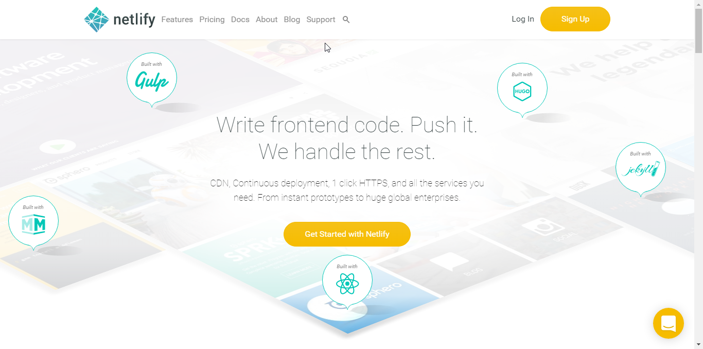
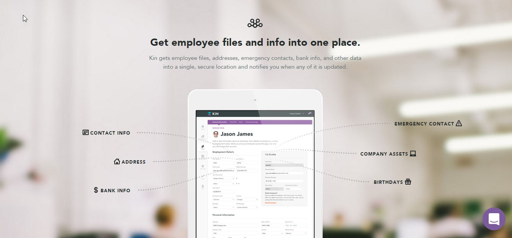
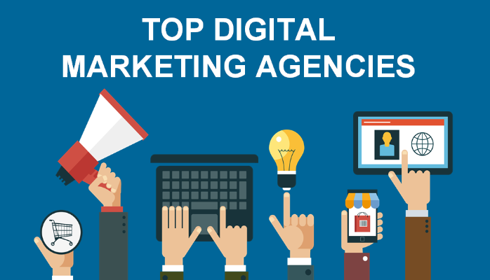

# Objectives for Revamp

Webfactories revamp should at least follow the design practices of our 7 principles of modern web design to the greatest extend possible. A proper representation of graphical interface like background image, icons, and animations.

# Menu

	-> The logo & hamburger menu should stick to the top when the page is scroll
	-> Add animation effects to the hamburger menu (please refer to allen for implementation)

# Slider

	Main Tagline	-> We enhance the online
	Subheader 		-> credibility of your business
	Background 		-> needs to be representing fast speeds (light), security and worldwide Internet/communication (please refer to our references below this guide)

# Feature 1

	Main Heading 	-> Design and Web Trends for 2017

	Paragraphs with icons

		[1] Please refer to https://deploy-preview-3.webfactories.sites.webriqs.com/
			- Key changes:
				- Remove the current background color
				- Make the animation colorful eg: refer to ( Web services: responsive website )

# Section 1

	Main Heading	-> Web Services
	Subheader 		-> Responsive Websites
	Image 			-> Emphasize the main heading

	Paragraphs with icons

		[1] No much changes on this section
			- Perhaps the background needs to be consistent in other sections.

		NOTE:
			- Also please update with the icons in the subpages.

# Section 2

	Main Heading	-> Web Services
	Subheader 		-> Responsive E-commerce Websites
	Image 			-> Emphasize the main heading

	Paragraphs with icons

		[1] Multi Platform
			- For use on desktops, tablets and smarthphone

		[2] Fast & Secure
			- Very secure solution with best industry practices and inline with PCI compliance

		[3] Quick & Easy Process
			- Large selection of payment and shipment methods integrated into standard shopping cart application

		[3] Enterprise Grade Features
			- Equipped with many out of the box enterprise grade features at no cost

		NOTE:
			- Please apply similar style with section 1.
			- Also please update with the icons in the subpages.

# Section 3

	Main Heading	-> Our Project

	NOTE:
		-> Remove SBR, Tymad Bistro and Australian Theatre Supplies from the list
		-> Suggest we provide a better layout for this one

# Section 4

	Main Heading 	-> Blogs
	Subheader		-> Recent blogs

	NOTE:
		-> Please refer to the style of the blog section of this site: http://www.jellyfish.net/?utm_source=Ankit%20Thakor&utm_medium=LinkedIN&utm_campaign=Digital%20Marketing
		-> As an example. Current cards are way to big in image size essentially.

# Footer

	RENAME EXISTING TAGLINE TO:

	NOTE:
		-> If you can provide a better layout much better
		-> Our office -> Our Offices
		-> Partner Companies
			- WebriQ
			- Buzzin Australia -> link to http://kallangur.buzzin.today
			- Buzzin UK -> link to http://northlanarkshire.buzzin.today

# Other Notes:

	- Some of the earlier changes had already been applied to the demo site here: https://deploy-preview-3.webfactories.sites.webriqs.com/
	- So the above guidelines are only applicable to the recent updates
	- The existing changes on the site will be carried with the new Design mock-up

# References

## Menu
- SVG type animation [https://codepen.io/kyleHenwood/pen/Alayb](https://codepen.io/kyleHenwood/pen/Alayb)

## Slider
- Moving background: [http://bert.house/en/"](http://bert.house/en/)
- 
- 
- 

## Blog
- 

